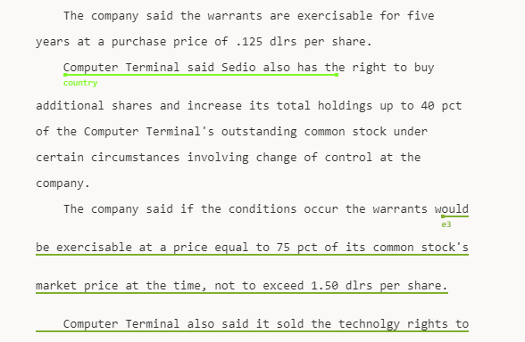

# Introduction

In this document, we discuss the implementation of the virtualization functionality of the labeler component. Virtualization is the process of only rendering the components visible in the viewport of a scrollable container. In terms of the labelers, the labeler should only render the lines that are currently within the visible area of the labeler. So if the labeler has 1000 lines, and the labeler container can only display 10 lines, then only 10 lines are rendered while the other 990 lines are removed from the DOM.

---

# Motivation for implementation

There are many 3rd party implementations for virtual rendering that you can plug and play in your projects. However, the labeler is a unique case. The labeler consists of two layers:

-   An HTML layer which renders the lines and the tokens.
-   An SVG layer which renders the annotation drawings.

The SVG layer overlays above the HTML layer using absolute positioning. That means the SVG layer has its own [stacking context](https://developer.mozilla.org/en-US/docs/Web/CSS/CSS_Positioning/Understanding_z_index/The_stacking_context). Since the rest of the labeler is statically positioned, it belongs to the default stacking context and it is relatively easy to control which layer displays over the other.

The problem is, most virtualization solutions applies absolute positioning or css-transform to be able to virtualize HTML elements, giving the HTML layer its separate stacking context. This separate stacking context conflicts with the SVG stacking context making it impossible to have both the HTML tokens and the SVG annotations be interactive with the mouse at the same time (one must overlay the other). Even more, because the SVG layer is a separate layer, we needed fine control over the virtual rendering start and ending indices to be able to account for annotations in the SVG layer.

To explain, consider the following diagram:

Imagine the borders of the photo are the labeler viewport and that the lines (indexed from 0 to 9) visible are the ones within the labeler visible area. There are two annotations in the snippet. One of the annotations starts and ends at line index 2, completely contained with the lines visible in the viewport. The other annotation starts at line index 6 and ends beyond the visible limits of the labeler (beyond line index 9). In order to render the annotation properly, we must also render all the lines that are part of this annotation even if they are not visible in the viewport. For example, if the annotation ended at line 12, then the virtual rendering should expand its limits to include all the way to line 12 to be able to view the annotation correctly.

---

# Implementation details

The virtualization implementation is inspired by the common solutions to virtual rendering. [This article](https://dev.to/adamklein/build-your-own-virtual-scroll-part-i-11ib) well explains how virtual rendering works in general. The solution is customized to our needs however, into these 4 building blocks:

-   `LabelerVirtualizationStore`
-   `useVirtualizer`
-   `LineRenderer`
-   `SvgLayoutController`

## LabelerVirtualizationStore

This store contains virtualization state pertinent to rendering the correct lines and SVG annotations in the labeler. It contains the following properties:

-   `startingLine`: The line index at which to start virtual rendering.
-   `endingLine`: The line index at which to end virtual rendering.
-   `areLinesRendered`: This boolean flag was introduced to solve an issue with observability. Whenever the store starting and ending lines are updated, the UI components react to this and the labeler starts trying to render annotations within the given indices. However this reaction occurs before the lines are actually rendered in the DOM. That is because MobX uses the observer pattern, so whenever MobX observables are updated, the list of subscribers are called instantly. In order to ensure that the subscribers don't execute before the lines with the new indices are actually rendered, we use this boolean `areLinesRendered`. Whenever the `startingLine` and `endingLine` state is changed, the `areLinesRendered` boolean is also marked as false in the same transaction. All subscribers reacting to the start and end line indices should ensure that this boolean is also marked as true before executing their actions.
    -   > Note that if set lines is called with values that are equal to the existing state of the starting and ending line, then the lines are not marked as not rendered, as the virtualization state will not change and the labeler will not need to re-render any new lines.
-   `lineHeights`: This is an array of the heights of all the lines visible in the labeler. This is updated every time a line changes its height either to due first time rendering or annotation change. The `lineHeights` array update is debounced using the private variable `_lineHeights`. This is to ensure that subscribers to the `lineHeights` array do not re-render multiple times in the case where multiple lines change their heights in one batch.

## useVirtualizer

This hook is the heart of the virtualization implementation. It is responsible for tracking the scrolling position, line heights, and annotation changes in the labeler and uses this information to calculate the starting and ending indices of the lines to virtual render in the current viewport.

The hook first calculates the starting and ending indices using the calculations explained in the article mentioned above. It then accounts for the annotations displayable in the labeler viewport and expands the line indices accordingly to include the annotations lines. See the image and example above for reference.

## LineRenderer

This component renders the HTML line that renders the tokens. As mentioned above, our custom implementation for virtual rendering differs than normal implementations due to the SVG overlay problem. Our custom implementation never really removes the line elements from the DOM. Rather, it includes the lines as empty DIV elements and populates those lines with tokens when they appear in the viewport. While this is less than ideal and DOES place a theoretical limit on the size of the documents that we can support, the limit is far beyond any useful use case we require in the labeler, supporting thousands of lines.

The `LineRenderer` component checks if its index is within the `LabelerVirtualizationStore` stored indices or not. If it is, then it is rendered normally with tokens. If it is not, an empty shell with the _same expected height of the line had it been rendered in full_ is rendered instead.

## SvgLayoutController

The SVG layout controller is responsible for rendering the annotations in the SVG layer. When virtual rendering is enabled, the controller only renders the annotations that are within the start and end line indices calculated by the `useVirtualizer` hook.

---
